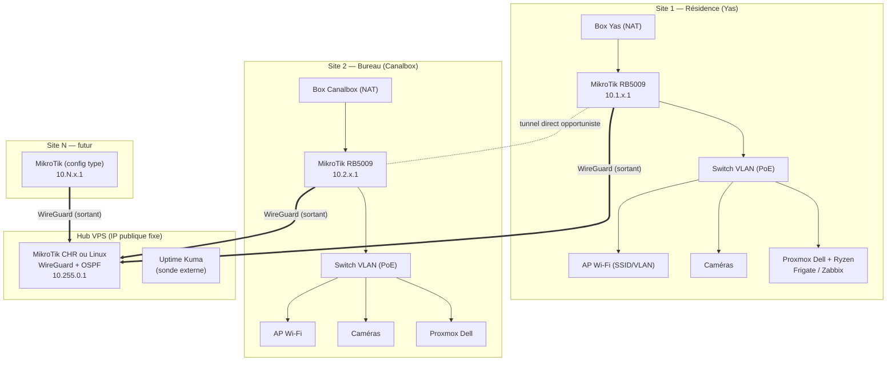

# 02 — Architecture cible

## Vue d'ensemble

## Choix structurants

### 1. Hub VPS à IP fixe (hub & spoke)

- IP publiques instables + box non bridgeables → **chaque site sort vers le VPS** ;
  aucune redirection de port, aucune dépendance à l'IP du site. Keepalive 25 s pour
  maintenir le NAT des box ouvert.
- Ajouter un site = une nouvelle interface côté hub + un routeur préconfiguré.
- VPS recommandé : MikroTik **CHR** (même outillage que les sites ; licence P1
  ≈ 1 Gb/s) ou Debian + WireGuard + FRR. Emplacement : Europe de l'Ouest (Paris /
  Marseille / Francfort) — les câbles sous-marins togolais y atterrissent, latence
  attendue 80–150 ms. **À mesurer** avant de choisir (voir questions ouvertes).
- Limite connue : le trafic résidence ↔ bureau fait l'aller-retour par le VPS.
  Atténuation : **tunnel direct opportuniste** entre sites (voir §4).

### 2. Un seul réseau logique en **routage L3**, pas un pont L2

« Même réseau » = **plan d'adressage unifié + routage entre tous les sites**. Une caméra
du bureau (`10.2.50.21`) est joignable depuis le NVR de la résidence exactement comme
une caméra locale : les NVR/Frigate ajoutent les caméras **par IP** (RTSP/ONVIF), ils
n'ont pas besoin d'être sur le même segment L2.

Pourquoi pas de pont L2 étendu :
- broadcast/ARP/DHCP de tous les sites traversent un montant de 10–50 Mb/s ;
- une panne de lien casse le domaine L2 entier ; boucles possibles ;
- difficile à dépanner et à faire grandir.

Exception prévue : si un équipement exige vraiment la découverte locale (mDNS, SSDP,
broadcast propriétaire), on étend **ce seul VLAN** via **EoIP over WireGuard**
(natif MikroTik) — au cas par cas, documenté ici.

### 3. Routage dynamique OSPF sur les tunnels

- OSPF (RouterOS v7) sur les interfaces WireGuard : chaque site annonce ses
  `10.N.0.0/16`, le hub redistribue. Aucun route statique à maintenir à l'ajout
  d'un site.
- Coûts OSPF : lien direct inter-sites < passage par le hub → le direct est préféré
  quand il fonctionne, bascule automatique sinon.

### 4. Tunnel direct opportuniste résidence ↔ bureau

Si au moins un des deux sites est joignable (IP publique non-CGNAT, redirection UDP
sur la box, DDNS via **MikroTik IP Cloud**), on monte en plus un tunnel WireGuard
direct. OSPF le préfère ; s'il tombe (IP changée), le trafic repasse par le hub.

### 5. Segmentation et pare-feu

- VLAN identiques sur tous les sites (voir [03-plan-adressage.md](03-plan-adressage.md)).
- Pare-feu sur chaque routeur de site, politique **par zone** (liste d'interfaces
  MikroTik) identique partout :

| De → Vers | ADMIN | SERV | USERS | IoT | CAM | GUEST | Internet |
|---|---|---|---|---|---|---|---|
| **ADMIN** | ✅ | ✅ | ✅ | ✅ | ✅ | ✅ | ✅ |
| **SERV** | ❌ | ✅ | ❌ | ✅¹ | ✅² | ❌ | ✅ |
| **USERS** | ❌ | ✅³ | ✅ | ✅⁴ | ❌ | ❌ | ✅ |
| **IoT** | ❌ | ❌ | ❌ | ✅ | ❌ | ❌ | ✅ (cloud Tuya) |
| **CAM** | ❌ | ❌ | ❌ | ❌ | ✅ | ❌ | ❌⁵ |
| **GUEST** | ❌ | ❌ | ❌ | ❌ | ❌ | ❌ | ✅ |

¹ Home Assistant/supervision vers IoT. ² NVR/Frigate vers caméras (RTSP 554, ONVIF).
³ Services publiés (web, partage). ⁴ Selon besoin (casting…). ⁵ Voir questions ouvertes :
couper Internet aux caméras casse l'appli Tuya. Compromis possible : seuls les **NVR**
sortent vers le cloud, les caméras non.

- La zone ADMIN n'est joignable que depuis ADMIN et depuis un **VPN d'accès
  nomade** (WireGuard sur le hub) pour vos téléphones/PC en déplacement.

### 6. Services d'infrastructure par site

Chaque site reste **autonome si le tunnel tombe** :
- DHCP et DNS local sur le routeur du site (+ DNS récursif interne sur Proxmox) ;
- NVR/Frigate local qui enregistre les caméras du site en flux principal ;
- les vues inter-sites (NVR maison qui affiche les caméras du bureau) utilisent le
  **sous-flux** pour préserver le montant.

### 7. Résilience électrique et Internet

- **Onduleur** par site (routeur, switch, serveur, NVR), supervisé via NUT/SNMP.
- **Secours 4G** optionnel par site (Moov Africa ou Yas en 4G, sur un modem MikroTik
  LTE) : route par défaut de secours + tunnel de secours vers le hub.
