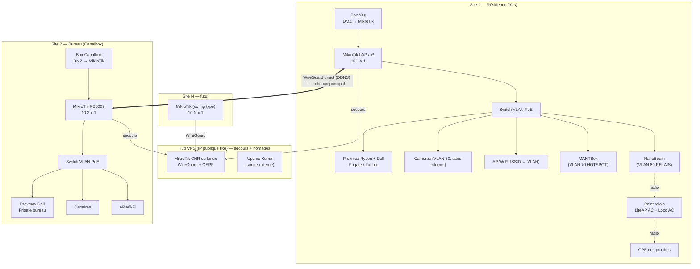

# 02 — Architecture cible

## Vue d'ensemble

## Choix structurants

### 1. Tunnels directs entre sites, VPS en secours

Les box ont une IPv4 publique (pas de CGNAT), mais elle change.
- Chaque box met le MikroTik en **DMZ** (à défaut : redirection du port UDP WireGuard).
- Chaque MikroTik publie son IP via **IP Cloud** (`<serial>.sn.mynetname.net`) ; les
  pairs WireGuard pointent vers ce nom. Un script planifié (toutes les 5 min) vérifie
  la résolution et met à jour l'*endpoint* si l'IP a changé.
- **Maillage direct** résidence ↔ bureau = chemin principal, sans détour ni latence
  supplémentaire.
- **VPS hub** (4–6 €/mois) : chaque site y maintient *aussi* un tunnel sortant. Il sert
  de chemin de secours quand une IP vient de changer, de point d'entrée fixe pour les
  **accès nomades** (téléphone, PC en déplacement), et de point de raccordement pour les
  futurs sites en 4G (CGNAT). Il peut être ajouté en phase 2 si on veut démarrer sans.

### 2. Un seul réseau logique en **routage L3**

« Même réseau » = **plan d'adressage unifié + routage entre tous les sites**. Une caméra
du bureau (`10.2.50.21`) est ajoutée au Frigate de la résidence **par son IP**
(ONVIF/RTSP), exactement comme une caméra locale. Pas besoin de pont L2.

Pas de pont L2 étendu (broadcast/ARP/DHCP sur 10–50 Mb/s de montant, domaine de panne
commun, boucles). Exception possible, au cas par cas : **EoIP over WireGuard** pour un
seul VLAN si un équipement exige la découverte locale.

### 3. Routage dynamique OSPF

OSPF (RouterOS v7) sur toutes les interfaces WireGuard. Chaque site annonce son
`10.N.0.0/16`. Coût faible sur le lien direct, coût élevé via le hub → bascule
automatique sur le hub si le lien direct tombe, retour automatique ensuite.
Ajouter un site = aucune route statique à toucher ailleurs.

### 4. Zones (VLAN) et pare-feu

Mêmes VLAN sur tous les sites (voir [03-plan-adressage.md](03-plan-adressage.md)),
plus deux zones **externes** à la résidence pour les utilisateurs non-membres du foyer :

| De → Vers | ADMIN | SERV | USERS | IoT | CAM | GUEST | HOTSPOT | RELAIS | Internet |
|---|---|---|---|---|---|---|---|---|---|
| **ADMIN** | ✅ | ✅ | ✅ | ✅ | ✅ | ✅ | ✅ | ✅ | ✅ |
| **SERV** | ❌ | ✅ | ❌ | ✅¹ | ✅² | ❌ | ❌ | ❌ | ✅ |
| **USERS** | ❌ | ✅³ | ✅ | ✅⁴ | ❌ | ❌ | ❌ | ❌ | ✅ |
| **IoT** | ❌ | ❌ | ❌ | ✅ | ❌ | ❌ | ❌ | ❌ | ✅ (cloud Tuya) |
| **CAM** | ❌ | ❌ | ❌ | ❌ | ✅ | ❌ | ❌ | ❌ | ❌ |
| **GUEST** | ❌ | ❌ | ❌ | ❌ | ❌ | ❌ | ❌ | ❌ | ✅ |
| **HOTSPOT** | ❌ | ❌ | ❌ | ❌ | ❌ | ❌ | ❌⁵ | ❌ | ✅ (après portail) |
| **RELAIS** | ❌ | ❌ | ❌ | ❌ | ❌ | ❌ | ❌ | ❌⁵ | ✅ |

¹ Home Assistant / supervision vers IoT. ² Frigate/NVR vers caméras (RTSP 554, ONVIF 80/8000).
³ Services publiés (web, partages). ⁴ Selon besoin (cast…). ⁵ Isolation entre clients.

- **Caméras sans Internet** : l'appli Tuya n'est pas indispensable, donc le VLAN CAM
  est totalement coupé d'Internet (plus de fuite vers le cloud, plus de porte dérobée).
  On les voit à distance via **Frigate** (ou Home Assistant) **à travers le VPN**.
- **Les zones ADMIN et SERV de tous les sites** ne sont joignables que depuis ADMIN et
  depuis le VPN nomade.
- Le trafic **inter-sites** n'est autorisé que pour ADMIN, SERV, USERS et CAM. HOTSPOT,
  RELAIS, GUEST et IoT ne sortent jamais de leur site.

### 5. Partage de connexion (hotspot et proches)

Aujourd'hui, les clients du hotspot et les proches raccordés par radio sont
probablement sur le même réseau que la maison. Cible :

- **VLAN 70 HOTSPOT** — port du switch dédié à la MANTBox. Deux options :
  - *Option A (recommandée)* : la MANTBox devient un simple point d'accès en pont sur le
    VLAN 70 ; le **portail captif tourne sur le routeur de la résidence (hAP ax³)** (MikroTik Hotspot, et plus
    tard User Manager pour les tickets/comptes). Une seule configuration à gérer, et
    les comptes ainsi que les journaux sont centralisés.
  - *Option B* : la MANTBox garde son portail ; elle est simplement isolée sur le VLAN 70.
- **VLAN 80 RELAIS** — le port de la NanoBeam est en *hybrid* : VLAN 80 **non tagué** (le
  trafic des proches y arrive sans aucune config sur leurs CPE) + VLAN 10 tagué pour le
  management des radios. Chaque CPE de proche reçoit une IP
  en DHCP du routeur de la résidence. Les radios Ubiquiti elles-mêmes sont administrées sur le VLAN
  **ADMIN** (VLAN de management des airMAX).
- **Partage du débit (QoS)** — le montant (10–50 Mb/s) est partagé entre vos usages, les
  caméras vues à distance, le hotspot et les proches. Files d’attente sur le routeur du site :
  1. priorité haute : ADMIN, VPN, voix/visio ;
  2. normale : USERS, SERV, flux caméras inter-sites ;
  3. basse et plafonnée : HOTSPOT et RELAIS, avec **PCQ** pour répartir équitablement
     entre clients, et un plafond global (par ex. 40 % du débit) ajustable.

> ⚠️ Revendre ou partager une connexion à des tiers peut être encadré par la
> réglementation (ARCEP Togo) et par le contrat de l'opérateur. À vérifier de votre côté.

### 6. Vidéosurveillance

- Caméras ONVIF → **Frigate** :
  - **Résidence** : Frigate sur le **Ryzen AI 9** (détection accélérée par iGPU/NPU via
    OpenVINO).
  - **Bureau** : Frigate sur le Dell (détection OpenVINO sur iGPU si le Xeon en a une,
    sinon clé **Coral USB** / Hailo-8L).
  - Chaque site **enregistre ses propres caméras en local** (flux principal) : rien ne
    traverse Internet pour l'enregistrement.
  - Vue unifiée : chaque Frigate affiche aussi les caméras de l'autre site en
    **sous-flux** (≈ 0,5 Mb/s par caméra), ou un tableau Home Assistant regroupe les deux.
- Les **NVR existants** peuvent rester en enregistreurs 24/7 de secours, s'ils
  enregistrent par ONVIF sans cloud ; à défaut, retrait.
- **Rétention 3 semaines**, stockage par site, enregistrement continu (marge 20 %) :

| Débit par caméra | Par caméra / 21 j | 15 caméras / 21 j |
|---|---|---|
| 2 Mb/s (H.265, 4 MP) | ~450 Go | **~7 To** → prévoir 8 To |
| 4 Mb/s (H.264, 1080p–4 MP) | ~900 Go | **~14 To** → prévoir 16 To |

  En pratique, on enregistre en continu en sous-flux et en flux principal uniquement sur
  événement (mouvement/personne). On divise ainsi le volume par 3 à 5 tout en gardant la
  pleine qualité des événements sur 3 semaines ou plus.

### 7. Autonomie de chaque site

Si les tunnels tombent, chaque site garde DHCP, DNS, Internet, Wi-Fi, hotspot et
enregistrement vidéo. Seules les vues inter-sites et la supervision centrale du site
distant sont interrompues (l'alerte part du VPS).

### 8. Résilience électrique et Internet

- **Onduleur** par site (routeur, switch PoE, serveur, NVR, radios), supervisé par NUT.
- **Secours 4G** optionnel : modem MikroTik LTE en seconde route par défaut. Le tunnel
  se remonte automatiquement via le hub (la 4G est souvent en CGNAT).
